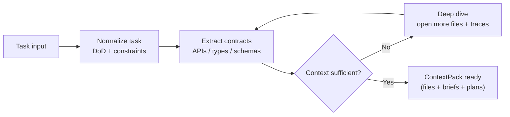
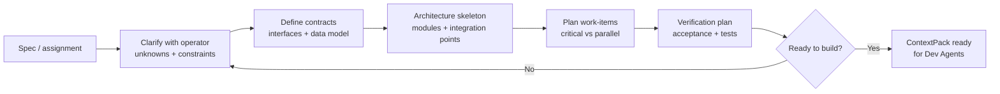
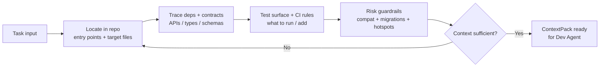

```mermaid
flowchart LR
    A["Task input"] --> B["Normalize task\nDoD + constraints"]
    B --> C["Extract contracts\nAPIs / types / schemas"]
    C --> D{"Context sufficient?"}

    D -->|No| E["Deep dive\nopen more files + traces"]
    E --> C

    D -->|Yes| F["ContextPack ready\n(files + briefs + plans)"]
```

---

## One-shot big task: spec-first context

```mermaid
flowchart LR
    A["Spec / assignment"] --> B["Clarify with operator\nunknowns + constraints"]
    B --> C["Define contracts\ninterfaces + data model"]
    C --> D["Architecture skeleton\nmodules + integration points"]
    D --> E["Plan work-items\ncritical vs parallel"]
    E --> F["Verification plan\nacceptance + tests"]
    F --> G{"Ready to build?"}
    G -->|No| B
    G -->|Yes| H["ContextPack ready\nfor Dev Agents"]
```

---

## Existing product: code-first context

```mermaid
flowchart LR
    A["Task input"] --> B["Locate in repo\nentry points + target files"]
    B --> C["Trace deps + contracts\nAPIs / types / schemas"]
    C --> D["Test surface + CI rules\nwhat to run / add"]
    D --> E["Risk guardrails\ncompat + migrations + hotspots"]
    E --> F{"Context sufficient?"}
    F -->|No| B
    F -->|Yes| G["ContextPack ready\nfor Dev Agent"]
```
 