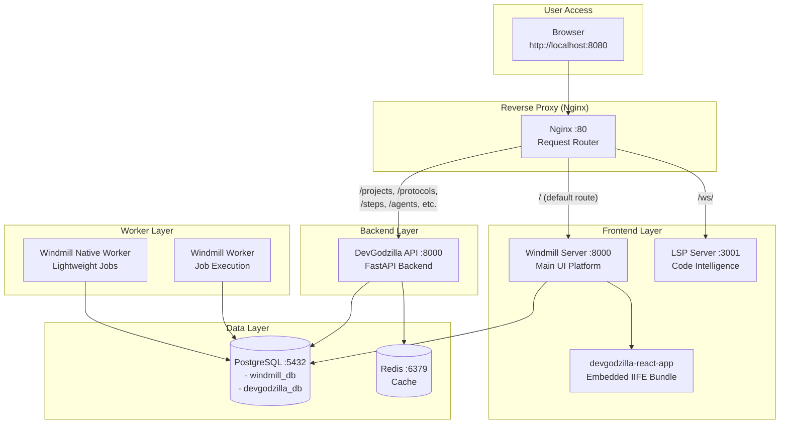

# DevGodzilla App Architecture

> **Last Updated**: 2025-12-18

This document describes the frontend and backend architecture for DevGodzilla, including service deployment, data flow, and development workflow.

---

## System Overview

DevGodzilla is deployed as a Docker Compose stack with the following components:



---

## Frontend Architecture

### Active Frontend: Windmill + DevGodzilla React App

The main user interface is served through **Windmill**, with DevGodzilla features embedded as a React application.

| Component | Location | Description |
|-----------|----------|-------------|
| **Windmill Server** | `Origins/Windmill/` | Svelte-based workflow platform UI |
| **DevGodzilla React App** | `windmill/apps/devgodzilla-react-app/` | React app bundled as IIFE |
| **React App Bundle** | `windmill/apps/devgodzilla-react-app/app.iife.js` | ~330KB production bundle |

### Frontend Structure

```
windmill/
├── apps/
│   ├── devgodzilla/                    # Windmill app definition (JSON)
│   │   └── [...app configs...]
│   └── devgodzilla-react-app/          # React application
│       ├── .env.development            # Windmill token config
│       ├── .env.example                # Environment template
│       ├── app.iife.js                 # Built React bundle (IIFE)
│       └── dist/                       # Build output
├── flows/                              # Windmill workflow definitions
├── scripts/                            # Windmill script definitions
└── import_to_windmill.py               # Import script for Windmill
```

### Archived Frontend

The standalone React console (`tasksgodzilla-console`) has been archived:

| Original Location | Archive Location |
|-------------------|------------------|
| `frontend/` | `archive/frontend-tasksgodzilla-console/` |

This was a Vite + React + TailwindCSS application that is no longer deployed.

---

## Backend Architecture

### DevGodzilla API

FastAPI-based backend providing REST endpoints for project and workflow management.

| Endpoint | Description |
|----------|-------------|
| `/health` | Health check endpoint |
| `/projects` | Project CRUD operations |
| `/protocols` | Protocol management |
| `/steps` | Step execution and status |
| `/agents` | Agent configuration |
| `/clarifications` | User clarification requests |
| `/speckit` | SpecKit integration |
| `/flows` | Windmill flow proxies |
| `/jobs` | Windmill job proxies |
| `/runs` | Run management |

### API Structure

```
devgodzilla/
├── api/
│   ├── app.py                 # FastAPI application
│   ├── routers/               # API route handlers
│   └── dependencies.py        # Dependency injection
├── cli/                       # CLI interface
├── config.py                  # Configuration
├── db/                        # Database models
├── engines/                   # Execution engines
├── models/                    # Pydantic schemas
├── services/                  # Business logic
└── windmill/                  # Windmill integration
```

---

## Service Configuration

### Docker Compose Services

| Service | Image/Build | Port | Purpose |
|---------|-------------|------|---------|
| `nginx` | nginx:alpine | 8080→80 | Reverse proxy |
| `devgodzilla-api` | ./Dockerfile | 8000 | Backend API |
| `windmill` | ./Origins/Windmill | 8000 | Frontend + API |
| `windmill_worker` | ./Origins/Windmill | - | Job execution |
| `windmill_worker_native` | ./Origins/Windmill | - | Native jobs |
| `lsp` | windmill-lsp:latest | 3001 | Code intelligence |
| `db` | postgres:16-alpine | 5432 | PostgreSQL |
| `redis` | redis:7-alpine | 6379 | Cache |

### Request Routing (Nginx)

```nginx
# DevGodzilla API endpoints
/health, /projects, /protocols, /steps, /agents, /clarifications,
/speckit, /metrics, /webhooks, /events, /flows, /jobs, /runs,
/docs, /redoc, /openapi.json
→ devgodzilla-api:8000

# LSP WebSocket
/ws/ → lsp:3001

# Default (everything else)
/ → windmill:8000
```

---

## Development Workflow

### Building the React App

```bash
cd windmill/apps/devgodzilla-react-app

# Install dependencies
npm install

# Build IIFE bundle
npm run build

# Output: app.iife.js
```

### Importing to Windmill

After building, import scripts/flows/apps to Windmill:

```bash
# Using the import script
python windmill/import_to_windmill.py \
  --url http://localhost:8080 \
  --workspace demo1 \
  --token-file windmill/apps/devgodzilla-react-app/.env.development
```

### Starting the Stack

```bash
# Start all services
docker compose -f docker-compose.devgodzilla.yml up -d

# View logs
docker compose -f docker-compose.devgodzilla.yml logs -f

# Rebuild after changes
docker compose -f docker-compose.devgodzilla.yml up -d --build
```

---

## Database Schema

### PostgreSQL Databases

| Database | Owner | Purpose |
|----------|-------|---------|
| `windmill_db` | windmill | Windmill workflows, jobs, users |
| `devgodzilla_db` | devgodzilla | Projects, protocols, steps, agents |

Both databases are initialized via `scripts/init-db.sh`.

---

## Environment Variables

### DevGodzilla API

| Variable | Description |
|----------|-------------|
| `DEVGODZILLA_DB_URL` | PostgreSQL connection string |
| `DEVGODZILLA_LOG_LEVEL` | Logging level (INFO, DEBUG, etc.) |
| `DEVGODZILLA_WINDMILL_URL` | Windmill server URL |
| `DEVGODZILLA_WINDMILL_WORKSPACE` | Windmill workspace name |

### Windmill

| Variable | Description |
|----------|-------------|
| `DATABASE_URL` | PostgreSQL connection string |
| `MODE` | server, worker, indexer |
| `BASE_URL` | External access URL |
| `DEVGODZILLA_API_URL` | DevGodzilla API URL (for workers) |

---

## Health Monitoring

### Health Check Endpoints

```bash
# DevGodzilla API
curl http://localhost:8080/health
# Returns: {"status":"ok","version":"0.1.0","service":"devgodzilla"}

# Windmill
curl http://localhost:8080/api/version
# Returns: Windmill version info
```

### Docker Health Checks

All critical services have healthchecks configured:
- **nginx**: wget to /health
- **db**: pg_isready
- **windmill**: Python urllib check to /api/version
