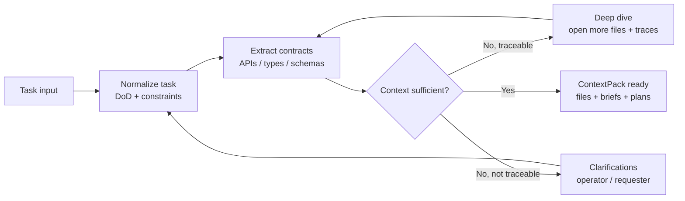
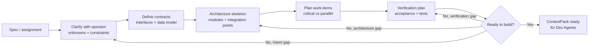
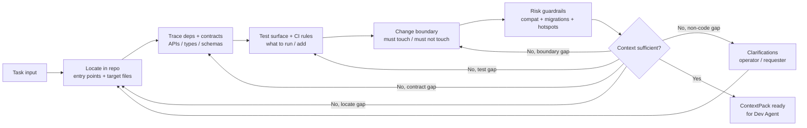

# Context Builder Flow

> Status: Design reference
> Scope: Context-building flow for brownfield work-items and one-shot larger tasks
> Derived from: `Screenshot 2026-03-19 at 18.43.50.png`
> Last updated: 2026-03-19

## Why this doc exists

This document captures the context-building flow shown in the screenshot as a concrete repo artifact.

It defines:

- the generic context-builder loop
- the spec-first variant for one-shot larger tasks
- the code-first variant for existing-product brownfield work
- the clarification path when repo inspection is not enough
- the expected `ContextPack` outcome when the flow is complete

This should be used as the reference for context-building behavior in task-cycle and brownfield workflow design.

## Core rule

The context builder should stop only when the task has enough grounded repo context to hand work to an implementation agent safely.

That means the output is not just a summary. The output is a concrete `ContextPack` with the files, traces, constraints, and execution guidance needed by the next stage.

If the missing information cannot be recovered from code, the flow must raise clarifications instead of pretending the repo contains an answer.

## 1. Generic Context Builder Loop

This is the smallest common flow behind all variants.

## 2. One-Shot Big Task: Spec-First Context

Use this variant when the work is still solution-shaping, architecture-heavy, or not yet grounded enough in the codebase.

Typical signals:

- the task is broad or ambiguous
- contracts are not settled yet
- architecture and integration boundaries need to be defined first
- the work will likely split into multiple work-items

## 3. Existing Product: Code-First Context

This is the primary brownfield context-building path for the current product direction.

Use this when the repo already exists and the task is mainly about changing working code safely.

Typical signals:

- there is an existing product and codebase
- the task already points to likely entry points or target areas
- the main risk is hidden coupling, regressions, or missing test coverage
- implementation should stay grounded in real files instead of speculative architecture

## Recommended V1 Usage

For DevGodzilla task-cycle v1:

- use the code-first flow as the default brownfield context-builder path
- use the spec-first flow when the task is too ambiguous or too large to enter implementation safely
- keep the generic sufficiency loop in both variants
- do not silently substitute guesswork for missing business intent; raise clarifications instead

This matches the current product intent:

- task-cycle work-items are projected over existing `step_runs`
- the backend owns artifact generation and persistence
- the context builder should produce implementation-ready repo guidance, not only abstract planning output

## Context Sufficiency Gate

`Context sufficient?` should evaluate whether the builder has enough detail to hand off work without avoidable ambiguity.

This should be a hard checklist, not an intuition call.

Required fields:

- goal is explicit
- acceptance criteria are explicit
- target files or entry points are identified
- required files are identified
- candidate files are identified separately from required files
- relevant contracts, APIs, schemas, or types are traced
- required validation and test commands are known
- change boundary is explicit
- major risks or hotspots are called out
- open questions are either empty or explicitly recorded as clarifications

Optional but useful:

- manifest files
- style guides
- dependency traces beyond the immediate edit surface
- suggested review focus areas

If any of those are missing, the builder should keep tracing or return clarification needs instead of pretending the handoff is complete.

## Clarification Rule

The builder should open clarifications when the missing context is not recoverable from local code and artifacts.

Typical clarification triggers:

- business rule ambiguity
- acceptance criteria conflict
- unclear user-facing behavior
- missing product decision between multiple valid implementations
- non-obvious rollout or migration expectation

Clarification should not be used for information that can be discovered by opening the repo, tracing imports, reading tests, or checking project manifests.

## Expected ContextPack Output

At minimum, the context builder should produce:

- task goal
- acceptance criteria
- entry points
- required files
- candidate files
- traced contracts, APIs, schemas, and types
- test commands and CI expectations
- change boundary
- review focus
- risk hotspots
- assumptions
- open questions

Suggested persisted outputs:

- `context_pack.json`
- `context_pack.md`

## Mapping To Current DevGodzilla Direction

The screenshot flow aligns best with the current brownfield task-cycle direction when interpreted like this:

- `Locate in repo` maps to repo entry-point discovery and target-file curation
- `Trace deps + contracts` maps to file tracing and contract extraction
- `Test surface + CI rules` maps to exact validation commands and expected checks
- `Change boundary` maps to explicit touched-vs-untouched scope control for brownfield safety
- `Risk guardrails` maps to compatibility, migration, and hotspot detection
- `ContextPack ready` maps to the persisted task-cycle artifact used by implement, review, and QA stages

## ContextPack Consumers

The same `ContextPack` should be used by all downstream stages:

- implement: to know where to edit and what constraints apply
- review: to evaluate whether the change matched the intended scope and contracts
- qa: to run the right validation surface and focus checks on known risks

The system should avoid regenerating separate ad hoc context for each stage unless the work-item has materially changed.

## Non-Goals For V1

This flow does not require:

- first-class multi-lane scheduling inside context building
- a separate work-item table
- fully dynamic flow synthesis before shipping the default path

The main requirement for v1 is a reliable, explicit, reusable context handoff artifact.
