# DevGodzilla Windmill Workflows

> Detailed documentation for Windmill scripts, flows, and integration patterns

---

## Overview

DevGodzilla uses Windmill as its workflow orchestration engine, replacing the previous Redis/RQ implementation. This document describes the available scripts, flows, and how to use them for AI-driven development.

**Current-state reference:** `docs/DevGodzilla/CURRENT_STATE.md`

```mermaid
graph TB
    subgraph Flows["Windmill Flows"]
        OnboardFlow[project_onboarding]
        SpecFlow[spec_to_tasks]
        SpecProtoFlow[spec_to_protocol]
        ExecFlow[execute_protocol]
        NextStep[run_next_step]
    end
    
    subgraph Scripts["Windmill Scripts"]
        Clone[clone_repo]
        Analyze[analyze_project]
        Init[initialize_speckit]
        Setup[project_setup]
        
        SpeckitSpec[speckit_specify_api]
        SpeckitPlan[speckit_plan_api]
        SpeckitTasks[speckit_tasks_api]
        ProtoFromSpec[protocol_from_spec_api]
        ProtoStart[protocol_plan_and_wait]

        ExecStep[step_execute_api]
        StepQA[step_run_qa_api]
        Feedback[handle_feedback]
        OpenPR[open_pr]
    end
    
    OnboardFlow --> Clone & Analyze & Init
    SpecFlow --> SpeckitSpec & SpeckitPlan & SpeckitTasks
    SpecProtoFlow --> ProtoFromSpec & ProtoStart
    ExecFlow --> ExecStep
    NextStep --> ExecStep
```



## Where these live (in this repo)

- Flow JSON exports: `windmill/flows/devgodzilla/`
- Python scripts intended for Windmill runtime: `windmill/scripts/devgodzilla/`
- Scripts call the DevGodzilla API via `windmill/scripts/devgodzilla/_api.py` using `DEVGODZILLA_API_URL` (Docker Compose sets this for the Windmill server/workers).

---

## Docker Compose bootstrap (single-solution stack)

The repo’s `docker-compose.yml` brings up nginx + DevGodzilla API + Windmill + workers + DB + Redis.

```bash
docker compose up --build -d
docker compose logs -f windmill_import
```

`windmill_import` imports local assets into Windmill:
- `windmill/scripts/devgodzilla/` → `u/devgodzilla/*`
- `windmill/flows/devgodzilla/` → `f/devgodzilla/*`
- `windmill/apps/devgodzilla/` + `windmill/apps/devgodzilla-react-app/`

For local development, the Windmill token/workspace are typically kept in `windmill/apps/devgodzilla-react-app/.env.development` (local-only) and used by `windmill_import` via `--token-file`.

### Useful endpoints (via nginx)

- DevGodzilla OpenAPI: `http://localhost:8080/docs`
- Windmill API introspection through DevGodzilla: `http://localhost:8080/flows`, `http://localhost:8080/jobs`, `http://localhost:8080/runs`

---

## Scripts Reference

All scripts are located at `u/devgodzilla/` in Windmill.

### Foundation Scripts

#### clone_repo
Clone a GitHub repository to a local workspace.

#### analyze_project
Analyze a project's structure, detecting language, framework, and key files.

#### initialize_speckit
Initialize the `.specify/` directory structure with constitution and templates.

#### project_setup
**[NEW]** Full project initialization combining clone, analyze, SpecKit initialization, and database record creation.
- **Args**: `git_url`, `project_name`, `branch`, `constitution_template`
- **Output**: Project ID, path, analysis results

### Planning Scripts

#### speckit_specify_api / speckit_plan_api / speckit_tasks_api
API-wrapper scripts that call DevGodzilla SpecKit endpoints for spec/plan/tasks.

#### protocol_from_spec_api
Create a protocol run from SpecKit tasks via `/protocols/from-spec`.

### Execution Scripts

#### step_execute_api
Execute a single step via DevGodzilla API. QA auto-runs after execution.

#### step_run_qa_api
Manually re-run QA for a single step via DevGodzilla API.

#### handle_feedback
Handle feedback loop actions when QA fails (clarify, re-plan, retry).

#### open_pr
**[NEW]** Create GitHub/GitLab Pull Request for completed protocol.
- **Args**: `protocol_run_id`, `title`, `description`, `draft`
- **Output**: PR URL, PR number

---

## Flows Reference

All flows are located at `f/devgodzilla/` in Windmill.

### Supported flows (default stack)

These flows are intended to work in the default Docker Compose stack, without requiring Windmill workers to import the `devgodzilla` Python package (they rely on API-wrapper scripts):
- `onboard_to_tasks`
- `project_onboarding`
- `protocol_start`
- `run_next_step` (selection only; execution is separate)
- `step_execute_with_qa`
- `execute_protocol`
- `spec_to_tasks`
- `spec_to_protocol`
- `sprint_from_protocol`
- `sync_tasks_to_sprint`
- `complete_sprint`

Notes:
- `onboard_to_tasks` can optionally run headless repo discovery during onboarding (writes `tasksgodzilla/*`).

### Note: JavaScript `input_transforms` require `deno_core`

The `protocol_start`, `run_next_step`, and `step_execute_with_qa` flows use `input_transforms` of type `javascript` (e.g. `flow_input.protocol_run_id`, `results.select_next_step.step_run_id`). That requires Windmill to be built with the `deno_core` feature enabled.

The default `docker-compose.yml` build enables `deno_core` (see `WINDMILL_FEATURES` in compose). If you intentionally build Windmill as `python`-only (e.g. `WINDMILL_FEATURES="static_frontend python"` for faster builds), run the Python scripts directly instead:
- `u/devgodzilla/protocol_plan_and_wait`
- `u/devgodzilla/protocol_select_next_step`
- `u/devgodzilla/step_execute_api`
- For onboarding + SpecKit generation without JS transforms: `u/devgodzilla/onboard_to_tasks_api`
- For SpecKit -> protocol creation: `u/devgodzilla/protocol_from_spec_api`

### protocol_start
Plan a protocol in DevGodzilla (via API) and wait until it reaches a stable status (`planned`, `running`, `blocked`, etc).

Notes:
- Planning is **protocol-file driven** (`.protocols/<protocol_name>/step-*.md` in the protocol worktree).
- If protocol files are missing and `DEVGODZILLA_AUTO_GENERATE_PROTOCOL=true` (default), planning runs a headless agent to generate `.protocols/<protocol_name>/plan.md` + `step-*.md`.

### run_next_step
Select the next runnable step for a protocol (via API).

This flow/script is selection-only and returns a `step_run_id`; execution is performed separately (e.g., `step_execute_with_qa`).

### step_execute_with_qa
Execute a specific `step_run_id` (via API). QA auto-runs after execution.

### project_onboarding
Complete project setup: clone, analyze, and initialize SpecKit.

### spec_to_tasks
Generate spec → plan → tasks from a feature request.
optional: Sync generated tasks to a sprint if `sprint_id` is provided.

### spec_to_protocol
Generate spec → plan → tasks, create a protocol from SpecKit tasks, and start planning.

### sprint_from_protocol
Create a sprint from a protocol run and optionally sync steps as tasks.

### sync_tasks_to_sprint
Import SpecKit `tasks.md` into a sprint, optionally overwriting existing tasks.

### complete_sprint
Mark a sprint as completed and finalize metrics (actual velocity).

### execute_protocol
Execute a step via DevGodzilla API. QA auto-runs after execution.

---

## Resources Reference

Resources are located at `windmill/resources/devgodzilla/`.

### database.resource.yaml
PostgreSQL connection for DevGodzilla database.
- Port: 5432
- Database: devgodzilla

### agents.resource.yaml
Configuration for 7 AI agents:
- `codex` (OpenAI)
- `claude-code` (Anthropic)
- `opencode` (DeepSeek/Llama)
- `gemini-cli` (Google)
- `cursor` (IDE)
- `copilot` (GitHub)
- `qoder` (Experimental)

---

## Import Script

Use the import script to sync local changes to Windmill:

```bash
# Import everything (prefer token-file for local-only tokens)
python3 windmill/import_to_windmill.py \
  --url http://localhost:8000 \
  --workspace "${DEVGODZILLA_WINDMILL_WORKSPACE:-demo1}" \
  --token-file windmill/apps/devgodzilla-react-app/.env.development
```

---

## File Structure

```
windmill/
├── scripts/devgodzilla/           # API adapters + helpers
│   ├── project_setup.py
│   ├── protocol_from_spec_api.py
│   ├── protocol_plan_and_wait.py
│   ├── protocol_select_next_step.py
│   ├── step_execute_api.py
│   ├── step_run_qa_api.py
│   ├── open_pr.py
│   └── ... (other scripts)
│
├── flows/devgodzilla/             # Flow exports
│   ├── execute_protocol.flow.json
│   ├── protocol_start.flow.json
│   ├── step_execute_with_qa.flow.json
│   ├── spec_to_protocol.flow.json
│   ├── run_next_step.flow.json
│   └── ... (other flows, plus _deprecated/)
│
└── resources/devgodzilla/         # 2 Resources
    ├── database.resource.yaml
    └── agents.resource.yaml
```
