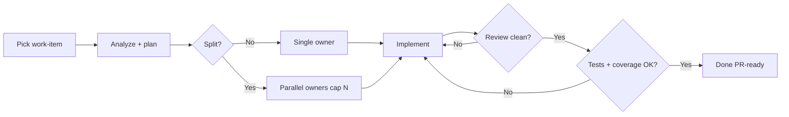

# Current User Flow From Screenshot

Derived from `Screenshot 2026-03-07 at 23.25.50.png`.

## Reference Status

Use this document as the default task-cycle reference for v1.

- `brownfield_feature` should use this as the default work-item loop
- later, a flow manager may select or generate alternate custom flow definitions
- until that exists, this document is the canonical task-cycle shape for implementation planning

## Workflow Cycle

```mermaid
flowchart LR
    start([Start]) --> worktree[Worktree setup<br/>Release Eng]
    worktree --> dispatcher[Dispatcher<br/>FlowConfig + DoD]
    dispatcher --> planning{Planning consilium<br/>3-4 roles}
    planning --> consolidation[Consolidation<br/>1 role]
    consolidation --> partitioning[Partitioning<br/>critical path vs parallel<br/>cap N]
    partitioning --> micro[Micro work-item loop<br/>repeat per item]
    micro --> integrate[Integrate<br/>Release Eng / Integrator]
    integrate --> review{Review loop<br/>3-4 roles<br/>until clean}
    review --> qa[QA gates<br/>tests + lint + coverage]
    qa --> pr[PR / Merge request<br/>Release Eng]
    pr --> postship[Post-ship / Analyst + SRE + Experiments]
    postship --> insights[Insights / metrics<br/>incidents + learnings]

    review -. findings .-> micro
    qa -. fail .-> micro
```

## Task Cycle

